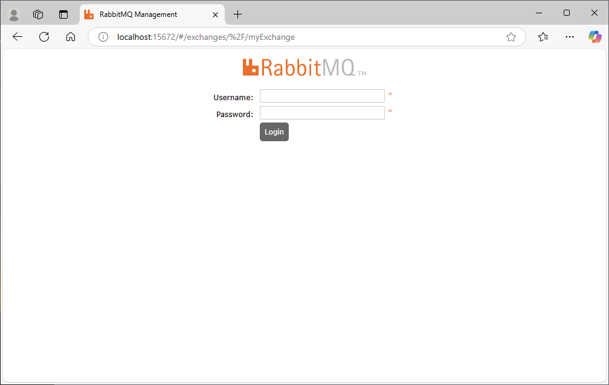

# Spring RabbitMQ Sample

## 概要

RabbitMQのサンプルプロジェクトです。Spring Boot を使用してメッセージングシステムを実装しています。

## RabbitMQとは

RabbitMQは、メッセージブローカーとして機能するオープンソースのメッセージキューサービスです。メッセージキューを使用して、アプリケーション間でメッセージを非同期に送信、受信、処理することができます。

## RabbitMQの特徴

- メッセージキューを使用して、アプリケーション間でメッセージを非同期に送信、受信、処理することができます。
- メッセージの永続化、配信保証、ルーティング、トランザクション、セキュリティ、監視などの機能があります。

## RabbitMQのイメージ

```
[Producer] -> [RabbitMQ] -> [Consumer]
```

## プロジェクト構成

spring-rabbitmq-sample/
├── producer/ # メッセージ送信側のアプリケーション
└── consumer/ # メッセージ受信側のアプリケーション

## 前提条件

- Java 17以上
- Docker
- Docker Compose
- RabbitMQ 3.12.1

## セットアップ

### 1. RabbitMQ + アプリケーションの起動

```bash
docker-compose up -d
```

### 2. 動作確認(RabbitMQ Management UIの場合)

ブラウザで `http://localhost:15672/` にアクセスして、RabbitMQの管理画面を開きます。



ログインすると以下のような画面が表示されます。
Exchangeタブをクリックして、`myExchange`のExchangeが作成されていることを確認します。


`myQueue`のリンクをクリックして、Publish Messageタブをクリックします。


Routing Keyにルーティングキーを入力して、Messageに`message`を入力して、Publishボタンをクリックします。
Publishに成功すると、以下のような画面が表示されます。


以下コマンドを入力し、受信メッセージを確認します。

```bash
docker logs -f consumer
```
### 3. 動作確認(APIの場合)

ブラウザを起動し、`http://localhost:8081/producer/send`にアクセスします。

以下コマンドを入力し、受信メッセージを確認します。

```bash
docker logs -f consumer
```

### Other

- このRabbitMQのサンプルプロジェクトを応用し、他のメッセージングシステムに対応させることができます。
